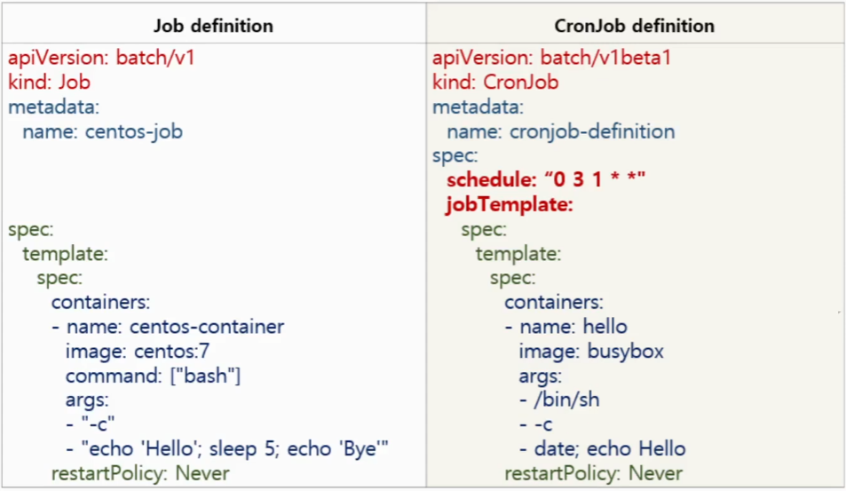

## Job

잡에서 하나 이상의 파드를 생성하고 지정된 수의 파드가 성공적으로 종료될 때까지 계속해서 파드의 실행을 재시도한다. 파드가 성공적으로 완료되면, 성공적으로 완료된 잡을 추적한다. 지정된 수의 성공 완료에 도달하면, 작업(즉, 잡)이 완료된다. 잡을 삭제하면 잡이 생성한 파드가 정리된다. 작업을 일시 중지하면 작업이 다시 재개될 때까지 활성 파드가 삭제된다.

간단한 사례는 잡 오브젝트를 하나 생성해서 파드 하나를 안정적으로 실행하고 완료하는 것이다. 첫 번째 파드가 실패 또는 삭제된 경우(예로는 노드 하드웨어의 실패 또는 노드 재부팅) 잡 오브젝트는 새로운 파드를 기동시킨다.

잡이 완료되면 파드가 더 이상 생성되지도 않지만, 삭제되지도 않는다. 이를 유지하면 완료된 파드의 로그를 계속 보며 에러, 경고 또는 다른 기타 진단 출력을 확인할 수 있다. 잡 오브젝트는 완료된 후에도 상태를 볼 수 있도록 남아 있다. 상태를 확인한 후 이전 잡을 삭제하는 것은 사용자의 몫이다. `kubectl` 로 잡을 삭제할 수 있다 (예: `kubectl delete jobs/pi` 또는 `kubectl delete -f ./job.yaml`). `kubectl` 을 사용해서 잡을 삭제하면 생성된 모든 파드도 함께 삭제된다.

기본적으로 파드의 실패(`restartPolicy=Never`) 또는 컨테이너가 오류(`restartPolicy=OnFailure`)로 종료되지 않는 한, 잡은 중단되지 않고 실행되고 이때 위에서 설명했던 `.spec.backoffLimit` 까지 연기된다. `.spec.backoffLimit` 에 도달하면 잡은 실패로 표기되고 실행 중인 모든 파드는 종료된다.

#### Job definition 예시

```yaml
apiVersion: batch/v1
kind: Job
metadata:
  name: pi
spec:
  template:
    spec:
      containers:
      - name: pi
        image: perl
        command: ["perl",  "-Mbignum=bpi", "-wle", "print bpi(2000)"]
      restartPolicy: Never
  backoffLimit: 4
```


참고 - https://kubernetes.io/ko/docs/concepts/workloads/controllers/job/


### CronJob

*크론잡은* 반복 일정에 따라 [잡](https://kubernetes.io/docs/concepts/workloads/controllers/job)을 만든다.

job 컨트롤러로 실행할 Application Pod를 주기적으로 반복해서 실행

다음과 같은 반복해서 실행해야 하는 job을 운영해야 할 때 사용

* Data Backup
* Send email
* Clening tasks


### 예시

이 크론잡 예제는 현재 시간과 hello 메시지를 1분마다 출력한다.

```yaml
apiVersion: batch/v1
kind: CronJob
metadata:
  name: hello
spec:
  schedule: "*/1 * * * *"
  jobTemplate:
    spec:
      template:
        spec:
          containers:
          - name: hello
            image: busybox
            imagePullPolicy: IfNotPresent
            command:
            - /bin/sh
            - -c
            - date; echo Hello from the Kubernetes cluster
          restartPolicy: OnFailure
```

#### 크론 스케쥴 문법

| 항목                   | 설명                     | 상응 표현 |
| ---------------------- | ------------------------ | --------- |
| @yearly (or @annually) | 매년 1월 1일 자정에 실행 | 0 0 1 1 * |
| @monthly               | 매월 1일 자정에 실행     | 0 0 1 * * |
| @weekly                | 매주 일요일 자정에 실행  | 0 0 * * 0 |
| @daily (or @midnight)  | 매일 자정에 실행         | 0 0 * * * |
| @hourly                | 매시 0분에 시작          | 0 * * * * |

예를 들면, 

다음은 해당 작업이 매주 금요일 자정에 시작되어야 하고, 매월 13일 자정에도 시작되어야 한다는 뜻이다.

`0 0 13 * 5`


### Job vs CronJob

definition 비교




## Controller 종류


