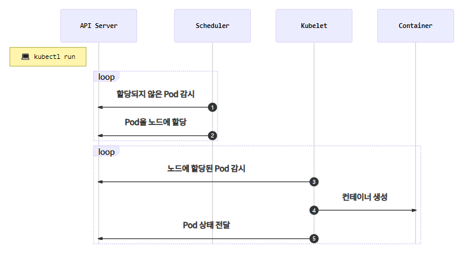

## Pod

> **pod란**?
>
> 컨테이너를 표현하는 K8S API의 최소 단위

Pod에는 하나 또는 여러 개의 컨테이너가 포함될 수 있다.

### Pod 생성과정



1. `Scheduler`는 API서버를 감시하면서 할당되지 않은unassigned `Pod`이 있는지 체크
2. `Scheduler`는 할당되지 않은 `Pod`을 감지하고 적절한 `노드`node에 할당 (minikube는 단일 노드)
3. 노드에 설치된 `kubelet`은 자신의 노드에 할당된 `Pod`이 있는지 체크
4. `kubelet`은 `Scheduler`에 의해 자신에게 할당된 `Pod`의 정보를 확인하고 컨테이너 생성
5. `kubelet`은 자신에게 할당된 `Pod`의 상태를 `API 서버`에 전달


### Pod 생성하기

* run 명령어를 이용해 생성
  * `$ kubectl run {pod명} --image={이미지명}`

```bash
$ kubectl run webserver --image=nginx:1.14
```

* pod yaml을 이용해 생성

```bash
$ kubectl create -f pod-nginx.yaml
```

```yaml
# pod-nginx.yaml

apiVersion: apps/v1
kind: Pod
metadata:
  name: webserver
spec:
  containers:
  - name: nginx-container
    image: nginx:1.14
    imagePullPolicy: Always
    ports:
    - containerPort: 80
      protocol: TCP
```


### 동작중인 Pod 확인

```bash
$ kubectl get pods
$ kubectl get pods -o wide
$ kubectl get pods -o yaml
$ kubectl get pods -o json
$ kubectl get pods webserver -o json | grep -i podip

# 접속해서 결과보기
$ curl {pod's IP address}
```


### multi-container pod 생성하기

* pod yaml을 이용해 생성

```bash
$ kubectl create -f pod-multi.yaml
```

```yaml
# pod-multi.yaml

apiVersion: apps/v1
kind: Pod
metadata:
  name: multipod
spec:
  containers:
  - name: nginx-container
    image: nginx:1.14
    ports:
    - containerPort: 80
      protocol: TCP
  - name: centos-container
    image: cetos:7
    command:
    - sleep
    - "10000"
```

* multipod 안에 있는 container들은 동일한 ip를 공유한다.

```shell
# centos-container 쉘 접속하여
$ kubectl exec multipod -it -c centos-container -- /bin/bash

# localhost 80 port로 접속하면 -> 같은 pod의 nginx web server로 접속된다.
$ curl http://localhost:80

# nginx container의 log를 확인
$ kubectl logs multipod -c nginx-container
# single-container 구성의 pod라면 pod이름만 쓰면 조회 가능
# ex) kubectl logs test01
```


### livenessProbe

컨테이너가 정상적으로 동작하는지 체크하고 정상적으로 동작하지 않는다면 **컨테이너를 재시작**하여 문제를 해결합니다.

```yml
apiVersion: v1
kind: Pod
metadata:
  name: echo-lp
  labels:
    app: echo
spec:
  containers:
    - name: app
      image: ghcr.io/subicura/echo:v1
      livenessProbe: # <<< livenessProbe 설정
        httpGet:
          path: /not/exist
          port: 8080
        initialDelaySeconds: 5
        timeoutSeconds: 2 # Default 1
        periodSeconds: 5 # Defaults 10
        failureThreshold: 1 # Defaults 3
```

잘못된 path(/not/exist)와 port(8080)를 입력하였을 경우

**상태 확인**

```text
NAME      READY   STATUS             RESTARTS   AGE
echo-lp   0/1     CrashLoopBackOff   3          65s
```

정상적으로 응답하지 않았기 때문에 Pod이 여러 번 재시작되고 `CrashLoopBackOff` 상태로 변경되었습니다.


### readinessProbe

컨테이너가 준비되었는지 체크하고 정상적으로 준비되지 않았다면 **Pod으로 들어오는 요청을 제외**합니다.

livenessProbe와 차이점은 문제가 있어도 Pod을 재시작하지 않고 요청만 제외한다는 점입니다.

```yml
apiVersion: v1
kind: Pod
metadata:
  name: echo-rp
  labels:
    app: echo
spec:
  containers:
    - name: app
      image: ghcr.io/subicura/echo:v1
      readinessProbe: # <<< readinessProbe 설정
        httpGet:
          path: /not/exist
          port: 8080
        initialDelaySeconds: 5
        timeoutSeconds: 2 # Default 1
        periodSeconds: 5 # Defaults 10
        failureThreshold: 1 # Defaults 3
```

**상태 확인**

```text
NAME      READY   STATUS    RESTARTS   AGE
echo-rp   0/1     Running   0          14s
```

READY상태가 `0/1`인 것을 확인할 수 있습니다.

### livenessProbe + readinessProbe

보통 `livenessProbe`와 `readinessProbe`를 같이 적용합니다. 상세한 설정은 애플리케이션 환경에 따라 적절하게 조정합니다.

```yml
apiVersion: v1
kind: Pod
metadata:
  name: echo-health
  labels:
    app: echo
spec:
  containers:
    - name: app
      image: ghcr.io/subicura/echo:v1
      livenessProbe:
        httpGet:
          path: /
          port: 3000
      readinessProbe:
        httpGet:
          path: /
          port: 3000
```

`3000`번 포트와 `/` 경로는 정상적이기 때문에 Pod이 오류없이 생성된 것을 확인할 수 있습니다.


