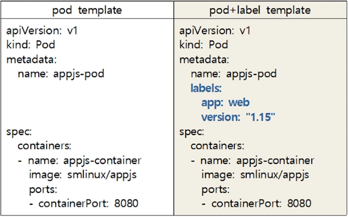

## Label

*레이블* 은 파드와 같은 오브젝트에 첨부된 키와 값의 쌍이다. 레이블은 오브젝트의 특성을 식별하는 데 사용되어 사용자에게 중요하지만, 코어 시스템에 직접적인 의미는 없다. 레이블로 오브젝트의 하위 집합을 선택하고, 구성하는데 사용할 수 있다. 레이블은 오브젝트를 생성할 때에 붙이거나 생성 이후에 붙이거나 언제든지 수정이 가능하다. 오브젝트마다 키와 값으로 레이블을 정의할 수 있다. 오브젝트의 키는 고유한 값이어야 한다.

```yaml
"metadata": {
  "labels": {
    "key1" : "value1",
    "key2" : "value2"
  }
}
```

레이블 예시

- `"release" : "stable"`, `"release" : "canary"`
- `"environment" : "dev"`, `"environment" : "qa"`, `"environment" : "production"`
- `"tier" : "frontend"`, `"tier" : "backend"`, `"tier" : "cache"`
- `"partition" : "customerA"`, `"partition" : "customerB"`
- `"track" : "daily"`, `"track" : "weekly"`

이 예시는 일반적으로 사용하는 레이블이며, 사용자는 자신만의 규칙(convention)에 따라 자유롭게 개발할 수 있다. 오브젝트에 붙여진 레이블 키는 고유해야 한다는 것을 기억해야 한다.

다음의 예시는 파드에 `environment: production` 과 `app: nginx` 2개의 레이블이 있는 구성 파일이다.

```yaml
apiVersion: v1
kind: Pod
metadata:
  name: label-demo
  labels:
    environment: production
    app: nginx
spec:
  containers:
  - name: nginx
    image: nginx:1.14.2
    ports:
    - containerPort: 80
```



## Selector

레이블 셀렉터를 통해 클라이언트와 사용자는 오브젝트를 식별할 수 있다.

```yaml
selector:
  matchLabels:
    component: redis
  matchExpressions:
    - {key: name, operator: In, values: [mainui]}
    - {key: rel, operator: NotIn, values: ["beta","canary"]}
```


#### 레이블 정보 보기

```bash
$ kubectl get pods --show-labels
```

```bash
# label 명이 같은 pod를 출력 (둘 다 결과 동일)
$ kubectl get pods -l name={라벨명}
$ kubectl get pods --selector name={라벨명}
```


#### command로 label 붙이기

* `$ kubectl label pod {pod명} {붙일 label}`

```bash
# name label이 없는 경우
$ kubectl label pod test-pod name=login
# 이미 있는 name label을 바꾸고 싶은 경우
$ kubectl label pod test-pod name=login --overwrite
# 복수 label 설정
$ kubectl label pod test-pod name=login rel=beta
# label 삭제 = 지울 레이블명 뒤에 -(대시문자)
$ kubectl label pod test-pod rel- #rel label 삭제
```


## Node label

Pod 뿐만 아니라 각각의 Node에도 label을 달 수 있음.

nodeSelector를 통해 특정 node를 선택해서 pod를 생성할 수 있음

```yaml
apiVersion: v1
kind: Pod
metadata:
  name: pod-nodeselector
  labels:
    app: nginx
spec:
  containers:
  - name: nginx
    image: nginx:1.14.2
  nodeSelector:
    key1: value1
    key2: value2
```

#### Label 보기

* `kubectl get nodes --show-labels`
* `kubectl get nodes -L {label이름}`

#### Label 관리

* `kubectl labe --help`

#### Label 생성 및 변경

* `kubectl label node {node이름} key=value`
* `kubectl label node {node이름} key=value --overwrite`

#### Label 확인

* `kubectl label node {node이름} --show-labels`

#### Label 제거

* `kubectl label node {node이름} key-`

