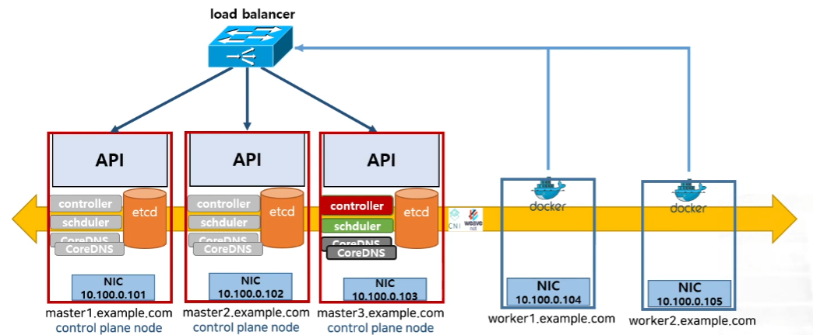

# Kubernetes

#### 쿠버네티스 개인 학습 레포지토리


출처

https://kubernetes.io/ko/docs/home/

https://subicura.com/k8s/

https://subicura.com/2019/05/19/kubernetes-basic-1.html

https://www.youtube.com/watch?v=6n5obRKsCRQ&list=PLApuRlvrZKohaBHvXAOhUD-RxD0uQ3z0c&ab_channel=TTABAE-LEARN

## 쿠버네티스가 왜 필요한가

**쿠버네티스는 컨테이너를 쉽고 빠르게 배포/확장하고 관리를 자동화해주는 오픈소스 플랫폼입니다.**

컨테이너는 애플리케이션을 포장하고 실행하는 좋은 방법입니다. 프로덕션 환경에서는 애플리케이션을 실행하는 컨테이너를 관리하고 가동 중지 시간이 없는지 확인해야 합니다. 예를 들어 컨테이너가 다운되면 다른 컨테이너를 다시 시작해야 합니다. 이 문제를 시스템에 의해 처리한다면 더 쉽지 않을까?

그것이 쿠버네티스가 필요한 이유! 쿠버네티스는 분산 시스템을 탄력적으로 실행하기 위한 프레임 워크를 제공합니다. 애플리케이션의 확장과 장애 조치를 처리하고, 배포 패턴 등을 제공합니다.

- **서비스 디스커버리와 로드 밸런싱** : 쿠버네티스는 DNS 이름을 사용하거나 자체 IP 주소를 사용하여 컨테이너를 노출할 수 있습니다. 컨테이너에 대한 트래픽이 많으면, 쿠버네티스는 네트워크 트래픽을 로드밸런싱하고 배포하여 배포가 안정적으로 이루어질 수 있습니다.

- **스토리지 오케스트레이션** : 쿠버네티스를 사용하면 로컬 저장소, 공용 클라우드 공급자 등과 같이 원하는 저장소 시스템을 자동으로 탑재 할 수 있습니다.

- **자동화된 롤아웃과 롤백** : 쿠버네티스를 사용하여 배포된 컨테이너의 상태를 보여주며 현재 상태를 설정한 속도에 따라 변경할 수 있습니다. 예를 들어 쿠버네티스를 자동화해서 배포용 새 컨테이너를 만들고, 기존 컨테이너를 제거하고, 모든 리소스를 새 컨테이너에 적용할 수 있습니다.

- **Auto scaling** : CPU, memory 사용량에 따른 확장은 기본이고 현재 접속자 수와 같은 값을 사용할 수도 있습니다. 컨테이너의 개수를 조정하는 Horizontal Pod Autoscaler(HPA), 컨테이너의 리소스 할당량을 조정하는 Vertical Pod Autoscaler(VPA), 서버 개수를 조정하는 Cluster Autosclaer(CA) 방식이 있습니다.

- **자동화된 복구(self-healing)** : 실패한 컨테이너를 다시 시작하고, 컨테이너를 교체하며, 응답하지 않는 컨테이너를 kill합니다. 이 모든 과정이 백그라운드 상에서 이루어집니다.

- **보안 및 구성 관리** : 쿠버네티스를 사용하면 암호, OAuth 토큰 및 SSH 키와 같은 중요한 정보를 저장하고 관리 할 수 있습니다. 컨테이너 이미지를 재구성하지 않고 스택 구성에 노출하지 않고도 애플리케이션 구성을 배포 및 업데이트 할 수 있습니다.

- **Namespace & Lable**

  하나의 클러스터를 논리적으로 구분하여 사용할 수 있습니다. 하나의 클러스터에 다양한 프레임워크와 애플리케이션을 설치하기 때문에 기본(`system`, `default`)외에 여러 개의 네임스페이스를 사용하는 것이 일반적입니다.

## Kubernetes Object

쿠버네티스는 상태를 관리하기 위한 대상을 오브젝트로 정의합니다. 기본으로 수십 가지 오브젝트를 제공하고 새로운 오브젝트를 추가하기가 매우 쉽기 때문에 확장성이 좋습니다. 여러 오브젝트 중 주요 오브젝트는 다음과 같습니다.

* **Pod** : 쿠버네티스에서 배포할 수 있는 가장 작은 단위로 한 개 이상의 컨테이너와 스토리지, 네트워크 속성을 가집니다. Pod에 속한 컨테이너는 스토리지와 네트워크를 공유하고 서로 localhost로 접근할 수 있습니다. 컨테이너를 하나만 사용하는 경우도 반드시 Pod으로 감싸서 관리합니다.
* **ReplicaSet** : Pod을 여러 개(한 개 이상) 복제하여 관리하는 오브젝트입니다. Pod을 생성하고 개수를 유지하려면 반드시 ReplicaSet을 사용해야 합니다. ReplicaSet은 복제할 개수, 개수를 체크할 라벨 선택자, 생성할 Pod의 설정값(템플릿)등을 가지고 있습니다. 직접적으로 ReplicaSet을 사용하기보다는 Deployment등 다른 오브젝트에 의해서 사용되는 경우가 많습니다.
* **Service** : 네트워크와 관련된 오브젝트입니다. Pod을 외부 네트워크와 연결해주고 여러 개의 Pod을 바라보는 내부 로드 밸런서를 생성할 때 사용합니다. 내부 DNS에 서비스 이름을 도메인으로 등록하기 때문에 서비스 디스커버리 역할도 합니다.
* **Volume** : 저장소와 관련된 오브젝트입니다. 호스트 디렉토리를 그대로 사용할 수도 있고 EBS 같은 스토리지를 동적으로 생성하여 사용할 수도 있습니다. 사실상 인기 있는 대부분의 저장 방식을 지원합니다.

### Object Spec - YAML

```yaml
apiVersion: v1
kind: Pod
metadata:
    name: example
spec:
    containers:
    - name: busybox
        image: busybox:1.25
```

오브젝트의 명세(spec)는 YAML 파일(JSON도 가능하다고 하지만 잘 안 씀)로 정의하고 여기에 오브젝트의 종류와 원하는 상태를 입력합니다. 이러한 명세는 생성, 조회, 삭제로 관리할 수 있기 때문에 REST API로 쉽게 노출할 수 있습니다. 접근 권한 설정도 같은 개념을 적용하여 누가 어떤 오브젝트에 어떤 요청을 할 수 있는지 정의할 수 있습니다.

## Architecture

컨테이너는 아주 심플하고 우아하게 동작합니다. run을 하면 실행되고 stop을 하면 멈춥니다. 서버-클라이언트 구조를 안다면 컨테이너를 관리하는 에이전트를 만들고 중앙에서 API를 이용하여 원격으로 관리하는 모습을 쉽게 그려볼 수 있습니다.


### 마스터 - 노드 구조

쿠버네티스는 전체 클러스터를 관리하는 **마스터**와 컨테이너가 배포되는 **노드**로 구성되어 있습니다. 모든 명령은 마스터의 API 서버를 호출하고 노드는 마스터와 통신하면서 필요한 작업을 수행합니다. 특정 노드의 컨테이너에 명령하거나 로그를 조회할 때도 노드에 직접 명령하는 게 아니라 마스터에 명령을 내리고 마스터가 노드에 접속하여 대신 결과를 응답합니다.


쿠버네티스는 전체 클러스터를 관리하는 **마스터**와 컨테이너가 배포되는 **노드**로 구성되어 있습니다. 모든 명령은 마스터의 API 서버를 호출하고 노드는 마스터와 통신하면서 필요한 작업을 수행합니다. 특정 노드의 컨테이너에 명령하거나 로그를 조회할 때도 노드에 직접 명령하는 게 아니라 마스터에 명령을 내리고 마스터가 노드에 접속하여 대신 결과를 응답합니다.

#### Master

마스터 서버는 다양한 모듈이 확장성을 고려하여 기능별로 쪼개져 있는 것이 특징 ~~고통~~ 입니다. 관리자만 접속할 수 있도록 보안 설정을 해야 하고 마스터 서버가 죽으면 클러스터를 관리할 수 없기 때문에 보통 3대를 구성하여 안정성을 높입니다. AWS EKS 같은 경우 마스터를 AWS에서 자체 관리하여 안정성을 높였고(마스터에 접속 불가) 개발 환경이나 소규모 환경에선 마스터와 노드를 분리하지 않고 같은 서버에 구성하기도 합니다.

#### Node

노드 서버는 마스터 서버와 통신하면서 필요한 Pod을 생성하고 네트워크와 볼륨을 설정합니다. 실제 컨테이너들이 생성되는 곳으로 수백, 수천대로 확장할 수 있습니다. 각각의 서버에 라벨을 붙여 사용목적(GPU 특화, SSD 서버 등)을 정의할 수 있습니다.

#### Kubectl

API 서버는 json 또는 protobuf 형식을 이용한 http 통신을 지원합니다. 이 방식을 그대로 쓰면 불편하므로 보통 `kubectl`이라는 명령행 도구를 사용합니다. 앞으로 엄청나게 많이 ~~지겹게~~ 사용할 예정입니다. 어떻게 읽어야 할지 난감한데 공식적으로 큐브컨트롤(cube control)이라고 읽지만 큐브씨티엘, 쿱컨트롤, 쿱씨티엘등도 많이 쓰입니다.

## Kubernetes Comonents

>  ### Master Component (Control Plane)


### kube-apiserver

API 서버는 모오오든 요청을 처리하는 마스터의 핵심 모듈입니다. kubectl의 요청뿐 아니라 내부 모듈의 요청도 처리하며 권한을 체크하여 요청을 거부할 수 있습니다. 실제로 하는 일은 원하는 상태를 key-value 저장소에 저장하고 저장된 상태를 조회하는 매우 단순한 작업입니다. Pod을 노드에 할당하고 상태를 체크하는 일은 다른 모듈로 분리되어 있습니다. 노드에서 실행 중인 컨테이너의 로그를 보여주고 명령을 보내는 등 디버거 역할도 수행합니다.

### 분산 데이터 저장소 etcd

RAFT 알고리즘을 이용한 key-value 저장소입니다. 여러 개로 분산하여 복제할 수 있기 때문에 안정성이 높고 속도도 빠른 편입니다. 단순히 값을 저장하고 읽는 기능뿐 아니라 watch 기능이 있어 어떤 상태가 변경되면 바로 체크하여 로직을 실행할 수 있습니다.

클러스터의 모든 설정, 상태 데이터는 여기 저장되고 나머지 모듈은 stateless하게 동작하기 때문에 etcd만 잘 백업해두면 언제든지 클러스터를 복구할 수 있습니다. etcd는 오직 API 서버와 통신하고 다른 모듈은 API 서버를 거쳐 etcd 데이터에 접근합니다.

### 스케줄러, 컨트롤러


* ### kube-scheduler

  스케줄러는 할당되지 않은 Pod을 여러 가지 조건(필요한 자원, 라벨)에 따라 적절한 노드 서버에 할당해주는 모듈입니다.

* ### kube-controller-manager

  큐브 컨트롤러는 다양한 역할을 하는 아주 바쁜 모듈입니다. 쿠버네티스에 있는 거의 모든 오브젝트의 상태를 관리합니다. 오브젝트별로 철저하게 분업화되어 Deployment는 ReplicaSet을 생성하고 ReplicaSet은 Pod을 생성하고 Pod은 스케줄러가 관리하는 식입니다.

  * node controller : 노드가 다운되었을 때 통지와 대응에 관한 책임을 가진다.
  * replication controller : 시스템의 모든 레플리케이션 컨트롤러 오브젝트에 대해 알맞은 수의 파드들을 유지시켜 주는 책임을 가진다.
  * end-point controller : 엔드포인트 오브젝트를 채운다(즉, 서비스와 파드를 연결시킨다.)
  * service account & token controller : 새로운 네임스페이스에 대한 기본 계정과 API 접근 토큰을 생성한다.

* ### cloud-controller-manager

  클라우드 컨트롤러는 AWS, GCE, Azure 등 클라우드에 특화된 모듈입니다. 노드를 추가/삭제하고 로드 밸런서를 연결하거나 볼륨을 붙일 수 있습니다. 각 클라우드 업체에서 인터페이스에 맞춰 구현하면 되기 때문에 확장성이 좋고 많은 곳에서 자체 모듈을 만들어 제공하고 있습니다.
  
  

>  ### Node Component
>
> 노드 컴포넌트는 동작 중인 파드를 유지시키고 쿠버네티스 런타임 환경을 제공하며, 모든 노드 상에서 동작한다.


* ### 큐블릿 kubelet

  노드에 할당된 Pod의 생명주기를 관리합니다. Pod을 생성하고 Pod 안의 컨테이너에 이상이 없는지 확인하면서 주기적으로 마스터에 상태를 전달합니다. API 서버의 요청을 받아 컨테이너의 로그를 전달하거나 특정 명령을 대신 수행하기도 합니다.

* ### kube-proxy

  큐블릿이 Pod을 관리한다면 프록시는 Pod으로 연결되는 네트워크를 관리합니다. TCP, UDP, SCTP 스트림을 포워딩하고 여러 개의 Pod을 라운드로빈 형태로 묶어 서비스를 제공할 수 있습니다. 초기에는 kube-proxy 자체가 프록시 서버로 동작하면서 실제 요청을 프록시 서버가 받고 각 Pod에 전달해 주었는데 시간이 지나면서 iptables를 설정하는 방식으로 변경되었습니다. iptables에 등록된 규칙이 많아지면 느려지는 문제 때문에 최근 IPVS를 지원하기 시작했습니다.

* ### Container Runtime

  컨테이너 실행을 담당하는 소프트웨어

---

### Pod 생성 과정


흐름을 보면 각 모듈은 서로 통신하지 않고 오직 API Server와 통신하는 것을 알 수 있습니다. API Server를 통해 etcd에 저장된 상태를 체크하고 현재 상태와 원하는 상태가 다르면 필요한 작업을 수행합니다. 각 모듈이 하는 일을 보면 다음과 같습니다.

**kubectl**

-  ReplicaSet 명세를 yml파일로 정의하고 kubectl 도구를 이용하여 API Server에 명령을 전달
-  API Server는 새로운 ReplicaSet Object를 etcd에 저장

**Kube Controller**

-  Kube Controller에 포함된 ReplicaSet Controller가 ReplicaSet을 감시하다가 ReplicaSet에 정의된 Label Selector 조건을 만족하는 Pod이 존재하는지 체크
-  해당하는 Label의 Pod이 없으면 ReplicaSet의 Pod 템플릿을 보고 새로운 Pod(no assign)을 생성. 생성은 역시 API Server에 전달하고 API Server는 etcd에 저장

**Scheduler**

-  Scheduler는 할당되지 않은(no assign) Pod이 있는지 체크
-  할당되지 않은 Pod이 있으면 조건에 맞는 Node를 찾아 해당 Pod을 할당

**Kubelet**

-  Kubelet은 자신의 Node에 할당되었지만 아직 생성되지 않은 Pod이 있는지 체크
-  생성되지 않은 Pod이 있으면 명세를 보고 Pod을 생성
-  Pod의 상태를 주기적으로 API Server에 전달

---

## Add-on

* 네트워크 애드온
  * CNI - weave, calico, flaneld, kube-route ...
* DNS 애드온
  * coreDNS
* 대시보드 UI 애드온
* 컨테이너 자원 모니터링
  * cAdvisor (kubelet에 기본으로 포함)
* 클러스터 로깅
  * 컨테이너 로그, k8s 운영 로그들을 수집해서 중앙화
  * ELK(ElasticSearch, Logstash, Kibana), Datadog ...


### Multi-master - Highly Available Kubernetes cluster 구성


